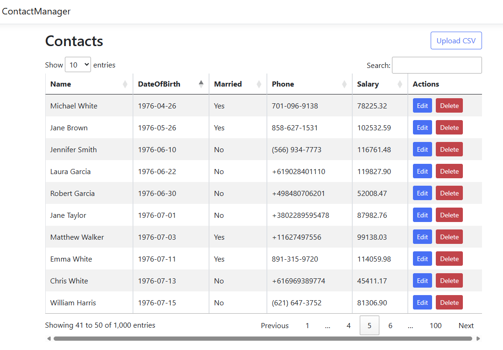
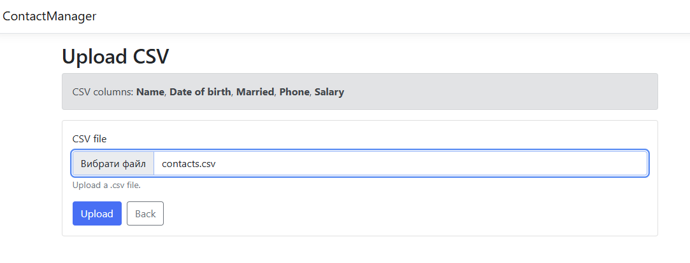

# 📇 Contact Manager

ASP.NET Core MVC application for managing contacts with:

- 📄 CSV file import
- 📊 Server-side DataTables integration (paging, sorting, filtering)
- ✏️ Edit and delete functionality
- 🐳 Dockerized environment with SQL Server
- ✅ Server & client-side validation

---

## 🏗 Tech Stack

- .NET 8
- ASP.NET Core MVC
- Entity Framework Core
- SQL Server 2022
- jQuery + DataTables
- Docker & Docker Compose

---

## 📸 Screenshots

### Contacts Table



### Upload Page



### Upload Result


# 🚀 Getting Started

## 🐳 Run with Docker (Recommended)

### 1️⃣ Create `.env` file in project root

Create a file named `.env` in the root folder:

```
SA_PASSWORD=YourStrong!Pass123
```

### 2️⃣ Restore frontend libraries (LibMan)

```bash
libman restore
```

### 3️⃣ Build and run containers

```bash
docker compose up --build
```

Application will be available at:

```
http://localhost:8080
```

SQL Server will be available at:

```
localhost:1433
```

---

### 4️⃣ Stop containers

```bash
docker compose down
```

To remove database volume:

```bash
docker compose down -v
```

---

# 💻 Run Without Docker (Local Development)

### 1️⃣ Configure connection string in `appsettings.Development.json`

```json
"ConnectionStrings": {
  "DefaultConnection": "YOUR_CONNECTION_STRING"
}
```

### 2️⃣ Restore dependencies

```bash
dotnet restore
libman restore
```

### 3️⃣ Apply migrations

```bash
dotnet ef database update
```

### 4️⃣ Run application

```bash
dotnet run
```

---

# 📄 CSV Import Format

Expected CSV columns:

| Column         | Type     |
|---------------|----------|
| Name          | string   |
| Date of birth | date     |
| Married       | bool     |
| Phone         | string   |
| Salary        | decimal  |

### Example CSV in root folder: contacts_1000.csv

```csv
Name,Date of birth,Married,Phone,Salary
John Doe,1990-05-12,true,1234567890,2500.50
Jane Smith,1985-03-01,false,5551234567,3100.00
```

### Supported Formats

- Date: `yyyy-MM-dd`, `dd.MM.yyyy`, `MM/dd/yyyy`
- Married: `true/false`, `yes/no`, `1/0`

---

# 📊 DataTables (Server-Side Mode)

The application uses server-side DataTables, meaning:

- Paging is handled on the server
- Sorting is handled on the server
- Searching is handled on the server
- Data is loaded asynchronously via AJAX


Ostap Hutsal
